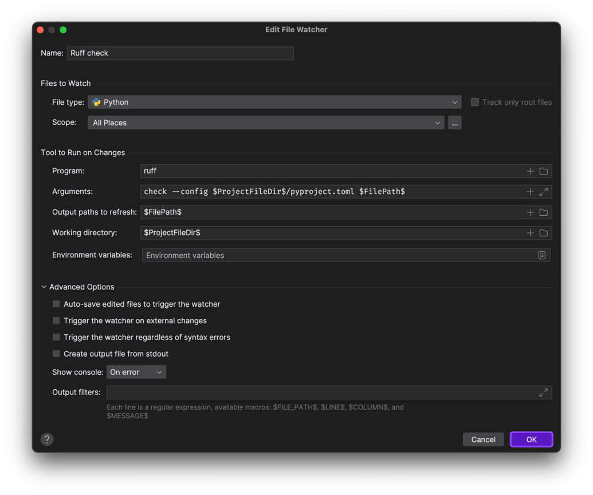
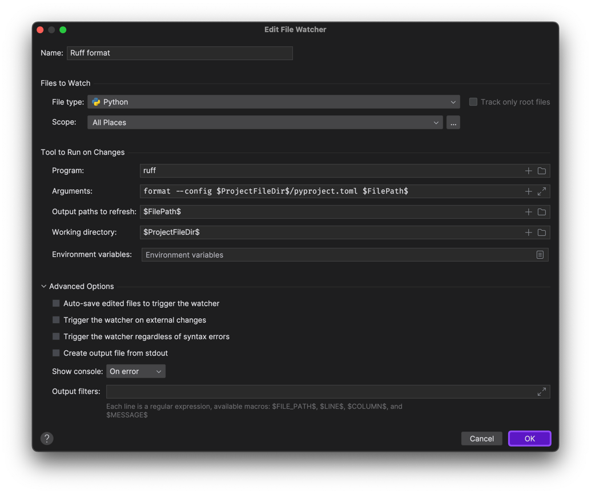

# Example of Django project using in telegram webApp

- I made everything on MacOS, in PyCharm, with Python 3.12.3.
- I just wanted to make a simple example of how to use Django with Telegram WebApp. My code is not perfect, but it
  works :D and remember that this is just an example :)

# Setting up the project

1. Download repository tp your local machine
2. Download and install Pyenv (optional, but I use it to manage Python versions)
3. Download and install `Python 3.12.3`
4. Download and install PyCharm (optional, but I do everything in it)
5. Install ruff to your global python (`pip install ruff==0.4.4`) (optional, but I use it to format code)
6. Create virtual environment to your project and activate it
7. Run `setup.sh` to install requirements, generate `DJANGO_SECRET_KEY` and make migrations
8. Run ngrok (`run_ngrok_server.sh`)
9. Add the url to the `ALLOWED_HOSTS` (without https) and `CSRF_TRUSTED_ORIGINS` (with http) in the `settings.py`
   file of the Django project
10. Set up the ngrok url in the WebApp settings in Telegram (BotFather)
11. Run `run_django_server.sh` to start the server

# Setting telegram bot and webApp

1. Create a bot in Telegram (BotFather)
2. Create a WebApp in Telegram (BotFather)
3. Set up ngrok and run it (`run_ngrok_server.sh`)
4. Set up url for WebApp in Telegram (BotFather)

# Setting up ngrok

1. Download ngrok (`brew install ngrok`)
2. Run ngrok (`run_ngrok_server.sh`)

# Setting formatters in Pycharm (optional)

In PyCharm, you can set up formatters to be automatically applied to changed files when saving.

1. Setting an alias for `ruff`:

- In the `~/.bashrc` / `~/.zshrc` file or in the windows env, add env variables for `ruff`:

```
export ruff="/Users/user_name/.pyenv/versions/3.12.3/bin/ruff" # specify your full path
```

2. Setting in `File Watcher` (`Preferences` -> `Tools` -> `File Watchers`):
	- `Ruff check` settings:
    ```
        File type: Any
        Scope: python
        Program: ruff 
        Argument: check --config $ProjectFileDir$/pyproject.toml $FilePath$
        OutPut paths to refresh: $FilePath$
        Working directory: $ProjectFileDir$
        Show console: On Error
        All checkboxes should be empty.
    ```
   
	- `Ruff format` settings (same as in `Ruff check` except `Argument`):
   ``` 
	   File type: Python
	   Scope: python
	   Program: ruff 
	   Argument: format --config $ProjectFileDir$/pyproject.toml $FilePath$
	   OutPut paths to refresh: $FilePath$
	   Working directory: $ProjectFileDir$
	   Show console: On Error
	   All checkboxes should be empty.
   ```
   
